# 元知 - 智能数字员工系统

一个基于大语言模型的智能数字员工系统,可以协助团队进行日常工作管理、知识沉淀和数据分析。

## 🌟 核心功能

### 1. 团队管理
- 团队组建与人员管理
- 项目创建与跟踪
- 任务分配与进度监控
- 团队协作评估

### 2. 知识管理
- 知识库文章管理
- 版本控制与变更追踪
- 评论与讨论功能
- 知识分享评估

### 3. 数据分析
- 团队绩效分析
- 协作效率评估
- 项目进度追踪
- 风险评估预警

### 4. 智能助理
- 自然语言交互
- 情感分析与回应
- 智能任务提醒
- 个性化建议

## 💡 技术架构

### 1. 后端架构
- **Web框架**: FastAPI
  * 异步处理
  * WebSocket实时通信
  * 依赖注入系统
  * OpenAPI文档自动生成

- **数据库设计**: SQLAlchemy ORM
  * 用户管理模型
  * 团队管理模型
  * 知识库模型
  * 分析统计模型
  * 关系映射与级联操作

- **AI引擎**: LangChain & LangGraph
  * DeepSeek大语言模型集成
  * 对话管理与状态追踪
  * 工具函数调用链
  * 记忆系统实现

### 2. 核心组件

#### 数据模型
```python
# 核心数据模型
- User: 用户信息管理
- Team: 团队信息管理
- Project: 项目管理
- Task: 任务管理
- KnowledgeBase: 知识库管理
- TeamMetrics: 团队指标
- TeamActivity: 团队活动
- TeamCollaboration: 团队协作
- PerformanceReview: 绩效评估
```

#### AI工具链
```python
# 核心工具类
- EmotionAnalysisTool: 情感分析
- TaskManagementTool: 任务管理
- TeamAnalyticsTool: 团队分析
- KnowledgeBaseTool: 知识库管理
```

#### API接口
```python
# 主要接口分类
- 团队管理API: /teams/*
- 项目管理API: /projects/*
- 任务管理API: /tasks/*
- 知识库API: /knowledge/*
- 分析统计API: /analytics/*
```

### 3. 功能实现

#### 团队管理系统
- **团队创建与管理**
  ```python
  @app.post("/teams")
  async def create_team(team_data: dict):
      return team_management_tool.create_team(team_data)
  ```

- **成员管理**
  ```python
  @app.post("/teams/{team_id}/members")
  async def add_team_member(team_id: int, member_data: dict):
      return team_management_tool.add_member(team_id, member_data)
  ```

#### 知识库系统
- **文章管理**
  ```python
  @app.post("/knowledge")
  async def create_article(article_data: dict):
      return knowledge_base_tool.create_article(article_data)
  ```

- **版本控制**
  ```python
  class KnowledgeRevision(Base):
      article_id = Column(Integer, ForeignKey("knowledge_base.id"))
      version = Column(Integer, nullable=False)
      content = Column(Text, nullable=False)
  ```

#### 分析系统
- **团队指标计算**
  ```python
  def calculate_team_metrics(self, team_id: int) -> Dict[str, Any]:
      return {
          "task_completion": self._calculate_task_metrics(),
          "collaboration_score": self._calculate_collaboration_score(),
          "knowledge_sharing": self._calculate_knowledge_metrics()
      }
  ```

- **风险评估**
  ```python
  def assess_team_risks(self, team_id: int) -> Dict[str, Any]:
      return {
          "high_risks": self._identify_high_risks(),
          "medium_risks": self._identify_medium_risks(),
          "low_risks": self._identify_low_risks()
      }
  ```

### 4. 数据流

```mermaid
graph TD
    A[用户请求] --> B[FastAPI路由]
    B --> C[CompanionAgent]
    C --> D[工具链]
    D --> E[数据库]
    D --> F[AI模型]
    F --> G[响应生成]
    G --> H[用户响应]
```



## 🚀 部署指南

### 1. 环境要求
- Python 3.10+
- PostgreSQL/SQLite
- FFmpeg (音频处理)

### 2. 安装步骤

1. **克隆仓库**
```bash
git clone https://github.com/yourusername/digital_employee.git
cd digital_employee
```

2. **创建虚拟环境**
```bash
conda create -n digital_employee python=3.10
conda activate digital_employee
```

3. **安装依赖**
```bash
pip install -r requirements.txt
```

4. **配置环境变量**
```bash
cp .env.example .env
# 编辑.env文件,填入必要的配置信息
```

5. **初始化数据库**
```bash
python -c "from app.core.database import init_db; init_db()"
```

6. **启动服务**
```bash
uvicorn main:app --host 0.0.0.0 --port 8001
```

## 📈 性能优化

### 1. 数据库优化
- 索引优化
- 查询缓存
- 连接池管理

### 2. API性能
- 异步处理
- 数据分页
- 响应缓存

### 3. AI引擎优化
- 模型量化
- 批处理请求
- 缓存机制

## 🔒 安全特性

### 1. 认证授权
- JWT认证
- 基于角色的访问控制
- API密钥管理

### 2. 数据安全
- 数据加密存储
- 敏感信息过滤
- 操作审计日志

### 3. 通信安全
- SSL/TLS加密
- WebSocket安全
- API请求限流

## 🔄 持续改进

### 1. 监控系统
- 性能监控
- 错误追踪
- 用户行为分析

### 2. 测试覆盖
- 单元测试
- 集成测试
- 性能测试

### 3. CI/CD
- 自动化构建
- 自动化测试
- 自动化部署

## 📊 技术栈

- **后端框架**: FastAPI
- **数据库**: SQLAlchemy + SQLite/PostgreSQL
- **AI模型**: DeepSeek + LangChain
- **工具链**: LangGraph
- **通信**: WebSocket
- **音频**: Edge-TTS + 讯飞语音

## 🤝 参与贡献

1. Fork 项目
2. 创建特性分支
3. 提交代码
4. 发起 Pull Request

## 📄 开源协议

MIT License

## 🔨 系统架构

### 1. 整体架构
```mermaid
graph TD
    A[用户层] --> B[接口层]
    B --> C[业务层]
    C --> D[核心层]
    D --> E[数据层]
    
    subgraph 用户层
    A1[Web界面] --> A2[WebSocket]
    A2 --> A3[HTTP API]
    end
    
    subgraph 接口层
    B1[FastAPI路由] --> B2[认证授权]
    B2 --> B3[请求处理]
    end
    
    subgraph 业务层
    C1[团队管理] --> C2[知识库]
    C2 --> C3[数据分析]
    C3 --> C4[任务管理]
    end
    
    subgraph 核心层
    D1[AI引擎] --> D2[工具链]
    D2 --> D3[记忆系统]
    end
    
    subgraph 数据层
    E1[SQLite/PostgreSQL] --> E2[文件存储]
    E2 --> E3[缓存系统]
    end
```

### 2. 核心模块

```mermaid
graph LR
    A[CompanionAgent] --> B[工具管理器]
    B --> C1[EmotionAnalysisTool]
    B --> C2[TaskManagementTool]
    B --> C3[TeamAnalyticsTool]
    B --> C4[KnowledgeBaseTool]
    
    A --> D[记忆管理器]
    D --> D1[对话历史]
    D --> D2[上下文管理]
    
    A --> E[状态管理器]
    E --> E1[会话状态]
    E --> E2[任务状态]
```


## 📁 文件架构

```
digital_employee/
├── app/
│   ├── agent/                 # AI代理相关
│   │   ├── companion_agent.py # 核心代理类
│   │   ├── tools.py          # 工具类集合
│   │   └── prompts.py        # 提示词模板
│   │
│   ├── core/                 # 核心功能
│   │   ├── models.py        # 数据模型
│   │   ├── database.py      # 数据库配置
│   │   ├── speech.py        # 语音处理
│   │   └── memory.py        # 记忆系统
│   │
│   └── web/                 # Web服务
│       ├── server.py        # FastAPI服务器
│       ├── routes/          # API路由
│       │   ├── teams.py     # 团队相关API
│       │   ├── tasks.py     # 任务相关API
│       │   └── knowledge.py # 知识库API
│       │
│       ├── middleware/      # 中间件
│       │   ├── auth.py      # 认证中间件
│       │   └── logging.py   # 日志中间件
│       │
│       └── websocket/       # WebSocket
│           └── handler.py   # WS处理器
│
├── config/                  # 配置文件
│   ├── config.py           # 主配置
│   └── logging.py          # 日志配置
│
├── tests/                  # 测试用例
│   ├── test_agent.py      # 代理测试
│   ├── test_tools.py      # 工具测试
│   └── test_api.py        # API测试
│
├── scripts/               # 脚本工具
│   ├── setup.sh          # 环境配置
│   └── deploy.sh         # 部署脚本
│
└── docs/                 # 文档
    ├── api/             # API文档
    ├── models/          # 模型文档
    └── deployment/      # 部署文档
```

## 🔄 主要流程

### 1. 请求处理流程

```mermaid
sequenceDiagram
    participant U as 用户
    participant F as FastAPI
    participant A as CompanionAgent
    participant T as 工具链
    participant D as 数据库
    
    U->>F: 发送请求
    F->>F: 认证授权
    F->>A: 转发请求
    A->>A: 分析意图
    A->>T: 选择工具
    T->>D: 数据操作
    D-->>T: 返回结果
    T-->>A: 处理结果
    A-->>F: 生成响应
    F-->>U: 返回响应
```


### 2. 对话处理流程

```mermaid
sequenceDiagram
    participant U as 用户
    participant W as WebSocket
    participant A as CompanionAgent
    participant E as 情感分析
    participant M as 记忆系统
    
    U->>W: 发送消息
    W->>A: 转发消息
    A->>E: 分析情感
    A->>M: 检索记忆
    M-->>A: 返回上下文
    A->>A: 生成回复
    A->>M: 更新记忆
    A-->>W: 发送回复
    W-->>U: 显示回复
```


### 3. 知识管理流程

```mermaid
sequenceDiagram
    participant U as 用户
    participant K as 知识库工具
    participant D as 数据库
    participant V as 版本控制
    
    U->>K: 创建/更新文章
    K->>D: 保存文章
    K->>V: 创建版本
    V->>D: 保存版本信息
    D-->>K: 确认保存
    K-->>U: 返回结果
```

